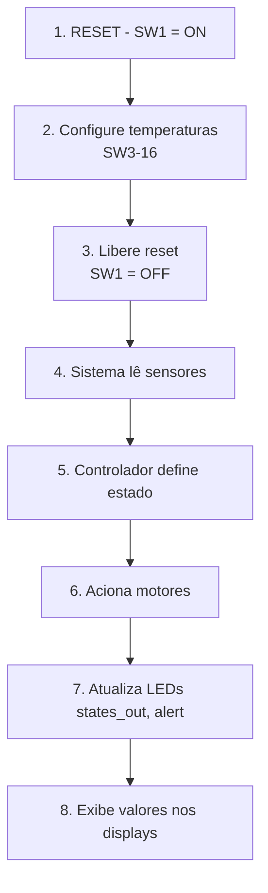

# Placa Altera DE2 - Mapeamento de Pinos
## Sistema de Controle de Temperatura

---

## 📌 Switches (Numerados da DIREITA para ESQUERDA)

| Posição | Switch | Função | Descrição |
|---------|--------|--------|-----------|
| Direita | **SW0** | N/A | Não utilizado |
| | **SW1** | **RST** | Reset do sistema |
| | **SW2** | N/A | Não utilizado |
| | **SW3-SW9** | **TEMP_INT_MIN** | Temperatura interna/mínima (7 bits) |
| Esquerda | **SW10-SW16** | **TEMP_EXT_MAX** | Temperatura externa/máxima (7 bits) |

> **Nota:** SW17 não é utilizado (apenas 17 switches ativos)

### Bit Mapping dos Switches

```
SW9  SW8  SW7  SW6  SW5  SW4  SW3    ← TEMP_INT_MIN
 ↓    ↓    ↓    ↓    ↓    ↓    ↓
bit6 bit5 bit4 bit3 bit2 bit1 bit0

SW16 SW15 SW14 SW13 SW12 SW11 SW10   ← TEMP_EXT_MAX
 ↓    ↓    ↓    ↓    ↓    ↓    ↓
bit6 bit5 bit4 bit3 bit2 bit1 bit0
```

---

## 💡 LEDs Verdes (Numerados da DIREITA para ESQUERDA)

| LED | Função | Descrição |
|-----|--------|-----------|
| **LEDG0-LEDG6** | **states_out[6:0]** | Estados do controlador (7 bits) |
| **LEDG7** | N/A | Não utilizado |
| **LEDG8** | N/A | Não utilizado |

```
LEDG8  LEDG7   LEDG6  LEDG5  LEDG4  LEDG3  LEDG2  LEDG1  LEDG0
 ( )    ( )     (●)    (●)    (●)    (●)    (●)    (●)    (●)
                └──────┴──────┴──────┴──────┴──────┴──────┘
                              STATES_OUT[6:0]
```

---

## 🔴 LEDs Vermelhos (Numerados da DIREITA para ESQUERDA)

| LED | Função | Descrição |
|-----|--------|-----------|
| **LEDR0** | **motor_pow_h** | Motor de aquecimento |
| **LEDR1** | **motor_pow_c** | Motor de resfriamento |
| **LEDR2-LEDR15** | N/A | Não utilizados |
| **LEDR16-LEDR17** | **led_alert** | Alerta crítico (duplo) |

```
LEDR17  LEDR16    LEDR15-2      LEDR1       LEDR0
 (●)     (●)       (...)         (●)         (●)
  └──────┘                        │           │
LED_ALERT                      MOTOR_C    MOTOR_H
(Alerta)                      (Resfria)  (Aquece)
```

---

## 🔢 Displays de 7 Segmentos

| Display | Função | Descrição |
|---------|--------|-----------|
| **HEX0** | Unidades | Dígito das unidades (0-9) |
| **HEX1** | Dezenas | Dígito das dezenas (0-9) |
| **HEX2-HEX7** | N/A | Não utilizados |

> **Importante:** Os displays usam lógica **ACTIVE LOW** (0 = LED aceso, 1 = LED apagado)

---

## 📋 Exemplo de Configuração

### Entrada: Temperatura 25°C (interna) e 20°C (externa)

#### Configuração dos Switches:

**SW1 = OFF** (sistema rodando)

**TEMP_INT_MIN = 25** (binário: `0011001`)
```
SW9  SW8  SW7  SW6  SW5  SW4  SW3
OFF  OFF  ON   ON   OFF  OFF  ON
 0    0    1    1    0    0    1   = 25 decimal
```

**TEMP_EXT_MAX = 20** (binário: `0010100`)
```
SW16 SW15 SW14 SW13 SW12 SW11 SW10
OFF  OFF  ON   OFF  ON   OFF  OFF
 0    0    1    0    1    0    0   = 20 decimal
```

#### Saídas Esperadas:

| Saída | Estado | Descrição |
|-------|--------|-----------|
| LEDG0-6 | Binário | Estado do controlador |
| LEDR0 | Aceso ● | Motor aquecimento ON |
| LEDR1 | Apagado | Motor resfriamento OFF |
| LEDR16-17 | Variável | Alerta se necessário |
| HEX1-HEX0 | Decimal | Valor calculado |

---

## 🔄 Fluxo de Operação



---

## 📊 Tabela de Conversão de Valores

| Temperatura | Binário (7 bits) | Switches a Ativar | Decimal |
|-------------|------------------|-------------------|---------|
| 0°C | `0000000` | Nenhum | 0 |
| 20°C | `0010100` | SW12, SW14 | 20 |
| 25°C | `0011001` | SW3, SW6, SW7 | 25 |
| 50°C | `0110010` | SW4, SW9, SW13 | 50 |
| 75°C | `1001011` | SW3, SW4, SW6, SW9 | 75 |
| 100°C | `1100100` | SW5, SW8, SW9 | 100 |
| 127°C | `1111111` | Todos (SW3-SW9) | 127 |

---

## ⚙️ Detalhes Técnicos

### Clock
- **Frequência:** 50 MHz (automático, não requer configuração)
- **Pino:** Gerenciado pela FPGA

### Lógica dos Displays
- **Tipo:** ACTIVE LOW
- **0:** LED aceso ✓
- **1:** LED apagado ✗

### Conversão BCD
- Componente `bin_to_bcd` converte valor binário de 7 bits para dois dígitos BCD
- HEX0 mostra unidades (0-9)
- HEX1 mostra dezenas (0-9)
- Valores acima de 99: dezena aparece apagada

---

## 📝 Notas Importantes

> [!WARNING]
> Os displays de 7 segmentos da DE2 são **ACTIVE LOW**. Certifique-se de que o decoder inverte os padrões.

> [!TIP]
> Use SW0 e SW2 para futuras expansões do projeto.

> [!NOTE]
> Na placa física, todos os componentes são numerados da **DIREITA para ESQUERDA**.
