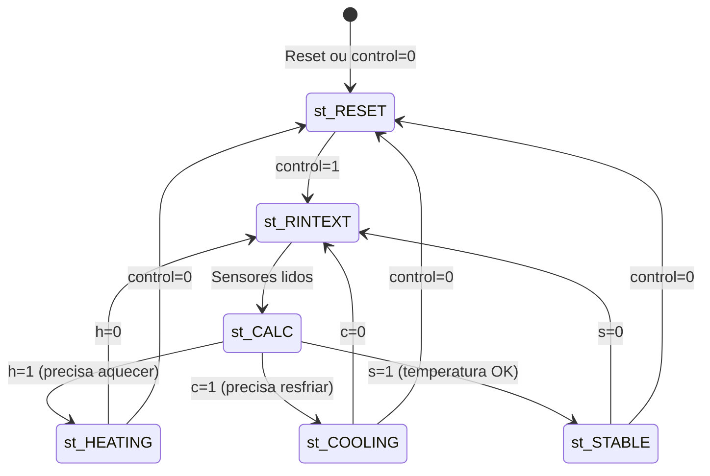

# Sistema de Controle de Temperatura em VHDL

## 📋 Contexto do Projeto

Este é um trabalho acadêmico de **Laboratório de Sistemas Digitais** desenvolvido em VHDL para implementação em FPGA. O projeto consiste em um **sistema de controle de temperatura** que monitora sensores internos e externos e aciona dispositivos de aquecimento/resfriamento para manter a temperatura em uma faixa ideal.

## 🎯 Objetivo

Desenvolver um sistema digital que:
- Lê temperaturas de sensores internos e externos
- Compara com valores mínimos e máximos configuráveis
- Calcula a potência necessária para aquecer ou resfriar
- Controla motores/atuadores de aquecimento e resfriamento
- Exibe o status e a potência em displays de 7 segmentos
- Gera alertas quando necessário

## 📁 Estrutura do Projeto

```
trabalho_final/
├── src/                          # Código-fonte VHDL
│   ├── design.vhd                # Top-level (integração)
│   ├── fsm.vhd                   # Controlador FSM
│   ├── datapath.vhd              # Caminho de dados
│   ├── clock.vhd                 # Divisor de clock
│   ├── control.vhd               # Decodificador de controle
│   ├── registrador.vhd           # Registrador genérico
│   ├── somador.vhd               # Somador
│   ├── subtrator.vhd             # Subtrator
│   ├── comparadorH.vhd           # Comparador de aquecimento
│   ├── comparadorC.vhd           # Comparador de resfriamento
│   ├── alertaComb.vhd            # Verificador de alertas
│   ├── decoder7seg.vhd           # Decodificador 7 segmentos
│   ├── shifter2.vhd              # Deslocador de 2 bits
│   ├── shifter4.vhd              # Deslocador de 4 bits
│   └── auxi.vhd                  # Componentes auxiliares
│
├── testbench/                    # Testbenches para simulação
│   ├── tb_design.vhd             # Testbench do sistema completo
│   ├── tb_H.vhd                  # Teste do comparador de aquecimento
│   ├── tb_C.vhd                  # Teste do comparador de resfriamento
│   ├── tb_heating.vhd            # Teste do controle de aquecimento
│   ├── tb_cooling.vhd            # Teste do controle de resfriamento
│   ├── tb_stable.vhd             # Teste do controle de estabilidade
│   ├── tb_registrador.vhd        # Teste do registrador
│   ├── tb_somador.vhd            # Teste do somador
│   ├── tb_subtrator.vhd          # Teste do subtrator
│   ├── tb_shifter2.vhd           # Teste do shifter de 2 bits
│   ├── tb_shifter4.vhd           # Teste do shifter de 4 bits
│   └── tb_comparador_diferente.vhd
│
├── top_level_pin_assignments.csv # Mapeamento de pinos (CSV)
├── pin_assignments.tcl           # Mapeamento de pinos (TCL)
├── DE2_pin_assignments.csv       # Pinos completos da DE2
├── MAPA_PINOS.md                 # Documentação do mapeamento
├── DIAGRAMA_PLACA_DE2.txt        # Diagrama visual da placa
└── README.md                     # Este arquivo
```

## 🏗️ Arquitetura do Sistema

O projeto segue a arquitetura **FSM + Datapath** (Finite State Machine + Caminho de Dados):

### 1. **Top Level** ([src/design.vhd](file:///c:/Users/070212/OneDrive%20-%20Construtora%20Barbosa%20Mello%20SA/%C3%81rea%20de%20Trabalho/Coisas/Faculdade/ENGENHARIA%20DE%20SISTEMAS/2025-02/LAB%20SISTEMAS%20DIGITAIS/trabalho_final/src/design.vhd))
- Módulo principal que integra todos os componentes
- Conecta o divisor de clock, controlador (FSM) e datapath
- Interface com o mundo externo (entradas/saídas da FPGA)

### 2. **Controller (FSM)** ([src/fsm.vhd](file:///c:/Users/070212/OneDrive%20-%20Construtora%20Barbosa%20Mello%20SA/%C3%81rea%20de%20Trabalho/Coisas/Faculdade/ENGENHARIA%20DE%20SISTEMAS/2025-02/LAB%20SISTEMAS%20DIGITAIS/trabalho_final/src/fsm.vhd))
- Máquina de estados finitos que controla o fluxo de operação
- **Estados:**
  - `st_RESET`: Estado inicial
  - `st_LOAD`: Carregamento de dados
  - `st_RINTEXT`: Leitura dos sensores
  - `st_CALC`: Cálculo de potência
  - `st_HEATING`: Modo aquecimento
  - `st_COOLING`: Modo resfriamento
  - `st_STABLE`: Temperatura estável

### 3. **Datapath** ([src/datapath.vhd](file:///c:/Users/070212/OneDrive%20-%20Construtora%20Barbosa%20Mello%20SA/%C3%81rea%20de%20Trabalho/Coisas/Faculdade/ENGENHARIA%20DE%20SISTEMAS/2025-02/LAB%20SISTEMAS%20DIGITAIS/trabalho_final/src/datapath.vhd))
- Responsável pelo processamento de dados
- Contém registradores, somadores, subtratores, comparadores
- Calcula a potência necessária baseado nas temperaturas
- Gera flags de status (h, c, s)

## 📦 Componentes Principais

| Arquivo | Descrição | Testbench |
|---------|-----------|-----------|
| [design.vhd](file:///c:/Users/070212/OneDrive%20-%20Construtora%20Barbosa%20Mello%20SA/%C3%81rea%20de%20Trabalho/Coisas/Faculdade/ENGENHARIA%20DE%20SISTEMAS/2025-02/LAB%20SISTEMAS%20DIGITAIS/trabalho_final/src/design.vhd) | Top-level do sistema | [tb_design.vhd](file:///c:/Users/070212/OneDrive%20-%20Construtora%20Barbosa%20Mello%20SA/%C3%81rea%20de%20Trabalho/Coisas/Faculdade/ENGENHARIA%20DE%20SISTEMAS/2025-02/LAB%20SISTEMAS%20DIGITAIS/trabalho_final/testbench/tb_design.vhd) |
| [fsm.vhd](file:///c:/Users/070212/OneDrive%20-%20Construtora%20Barbosa%20Mello%20SA/%C3%81rea%20de%20Trabalho/Coisas/Faculdade/ENGENHARIA%20DE%20SISTEMAS/2025-02/LAB%20SISTEMAS%20DIGITAIS/trabalho_final/src/fsm.vhd) | Controlador FSM (7 estados) | - |
| [datapath.vhd](file:///c:/Users/070212/OneDrive%20-%20Construtora%20Barbosa%20Mello%20SA/%C3%81rea%20de%20Trabalho/Coisas/Faculdade/ENGENHARIA%20DE%20SISTEMAS/2025-02/LAB%20SISTEMAS%20DIGITAIS/trabalho_final/src/datapath.vhd) | Caminho de dados | - |
| [clock.vhd](file:///c:/Users/070212/OneDrive%20-%20Construtora%20Barbosa%20Mello%20SA/%C3%81rea%20de%20Trabalho/Coisas/Faculdade/ENGENHARIA%20DE%20SISTEMAS/2025-02/LAB%20SISTEMAS%20DIGITAIS/trabalho_final/src/clock.vhd) | Divisor de clock (50MHz → 1Hz) | - |
| [control.vhd](file:///c:/Users/070212/OneDrive%20-%20Construtora%20Barbosa%20Mello%20SA/%C3%81rea%20de%20Trabalho/Coisas/Faculdade/ENGENHARIA%20DE%20SISTEMAS/2025-02/LAB%20SISTEMAS%20DIGITAIS/trabalho_final/src/control.vhd) | Decodificador de controle | - |

## 🧪 Testbenches

O projeto inclui **12 testbenches** completos para validação:

### Testbenches de Componentes
| Testbench | Componente Testado | Descrição |
|-----------|-------------------|-----------|
| [tb_design.vhd](file:///c:/Users/070212/OneDrive%20-%20Construtora%20Barbosa%20Mello%20SA/%C3%81rea%20de%20Trabalho/Coisas/Faculdade/ENGENHARIA%20DE%20SISTEMAS/2025-02/LAB%20SISTEMAS%20DIGITAIS/trabalho_final/testbench/tb_design.vhd) | Sistema completo | Teste integrado end-to-end |
| [tb_H.vhd](file:///c:/Users/070212/OneDrive%20-%20Construtora%20Barbosa%20Mello%20SA/%C3%81rea%20de%20Trabalho/Coisas/Faculdade/ENGENHARIA%20DE%20SISTEMAS/2025-02/LAB%20SISTEMAS%20DIGITAIS/trabalho_final/testbench/tb_H.vhd) | comparadorH | Testa flag de aquecimento |
| [tb_C.vhd](file:///c:/Users/070212/OneDrive%20-%20Construtora%20Barbosa%20Mello%20SA/%C3%81rea%20de%20Trabalho/Coisas/Faculdade/ENGENHARIA%20DE%20SISTEMAS/2025-02/LAB%20SISTEMAS%20DIGITAIS/trabalho_final/testbench/tb_C.vhd) | comparadorC | Testa flag de resfriamento |
| [tb_heating.vhd](file:///c:/Users/070212/OneDrive%20-%20Construtora%20Barbosa%20Mello%20SA/%C3%81rea%20de%20Trabalho/Coisas/Faculdade/ENGENHARIA%20DE%20SISTEMAS/2025-02/LAB%20SISTEMAS%20DIGITAIS/trabalho_final/testbench/tb_heating.vhd) | heat_control | Testa controle de aquecimento |
| [tb_cooling.vhd](file:///c:/Users/070212/OneDrive%20-%20Construtora%20Barbosa%20Mello%20SA/%C3%81rea%20de%20Trabalho/Coisas/Faculdade/ENGENHARIA%20DE%20SISTEMAS/2025-02/LAB%20SISTEMAS%20DIGITAIS/trabalho_final/testbench/tb_cooling.vhd) | cool_control | Testa controle de resfriamento |
| [tb_stable.vhd](file:///c:/Users/070212/OneDrive%20-%20Construtora%20Barbosa%20Mello%20SA/%C3%81rea%20de%20Trabalho/Coisas/Faculdade/ENGENHARIA%20DE%20SISTEMAS/2025-02/LAB%20SISTEMAS%20DIGITAIS/trabalho_final/testbench/tb_stable.vhd) | stable_control | Testa controle de estabilidade |
| [tb_registrador.vhd](file:///c:/Users/070212/OneDrive%20-%20Construtora%20Barbosa%20Mello%20SA/%C3%81rea%20de%20Trabalho/Coisas/Faculdade/ENGENHARIA%20DE%20SISTEMAS/2025-02/LAB%20SISTEMAS%20DIGITAIS/trabalho_final/testbench/tb_registrador.vhd) | registrador | Testa enable e reset |
| [tb_somador.vhd](file:///c:/Users/070212/OneDrive%20-%20Construtora%20Barbosa%20Mello%20SA/%C3%81rea%20de%20Trabalho/Coisas/Faculdade/ENGENHARIA%20DE%20SISTEMAS/2025-02/LAB%20SISTEMAS%20DIGITAIS/trabalho_final/testbench/tb_somador.vhd) | somador | Testa soma com carry |
| [tb_subtrator.vhd](file:///c:/Users/070212/OneDrive%20-%20Construtora%20Barbosa%20Mello%20SA/%C3%81rea%20de%20Trabalho/Coisas/Faculdade/ENGENHARIA%20DE%20SISTEMAS/2025-02/LAB%20SISTEMAS%20DIGITAIS/trabalho_final/testbench/tb_subtrator.vhd) | subtrator | Testa subtração com sinal |
| [tb_shifter2.vhd](file:///c:/Users/070212/OneDrive%20-%20Construtora%20Barbosa%20Mello%20SA/%C3%81rea%20de%20Trabalho/Coisas/Faculdade/ENGENHARIA%20DE%20SISTEMAS/2025-02/LAB%20SISTEMAS%20DIGITAIS/trabalho_final/testbench/tb_shifter2.vhd) | shifter (2 bits) | Testa divisão por 4 |
| [tb_shifter4.vhd](file:///c:/Users/070212/OneDrive%20-%20Construtora%20Barbosa%20Mello%20SA/%C3%81rea%20de%20Trabalho/Coisas/Faculdade/ENGENHARIA%20DE%20SISTEMAS/2025-02/LAB%20SISTEMAS%20DIGITAIS/trabalho_final/testbench/tb_shifter4.vhd) | shifter (4 bits) | Testa divisão por 16 |
| [tb_comparador_diferente.vhd](file:///c:/Users/070212/OneDrive%20-%20Construtora%20Barbosa%20Mello%20SA/%C3%81rea%20de%20Trabalho/Coisas/Faculdade/ENGENHARIA%20DE%20SISTEMAS/2025-02/LAB%20SISTEMAS%20DIGITAIS/trabalho_final/testbench/tb_comparador_diferente.vhd) | comparador | Testa igualdade/diferença |

## 🔄 Fluxo de Operação



## 🔢 Cálculo de Potência

```
Média = (temp_max + temp_min) / 2
Diferença_Desejada = Média - temp_int
Diferença_Real = temp_ext - temp_int
Potência = (Diferença_Desejada - Diferença_Real) / 4
```

## 🎛️ Entradas e Saídas

### Entradas
- `clk_50MHz`: Clock principal da FPGA (50 MHz)
- `rst`: Reset (SW1)
- `temp_int_min`: Temperatura interna/mínima (SW3-9, 7 bits)
- `temp_ext_max`: Temperatura externa/máxima (SW10-16, 7 bits)

### Saídas
- `led_heat`, `led_cool`, `led_stable`, `led_alert`: LEDs de status
- `motor_pow_c`, `motor_pow_h`: Sinais para motores
- `power_out`: Potência calculada (7 bits, LEDR0-6)
- `hex0`, `hex1`: Displays de 7 segmentos

## 🧪 Como Simular

### Usando GHDL + GTKWave

```bash
# 1. Compilar todos os arquivos
cd src
ghdl -a *.vhd
cd ../testbench
ghdl -a *.vhd

# 2. Elaborar o testbench desejado
ghdl -e tb_design

# 3. Rodar simulação
ghdl -r tb_design --vcd=waveform.vcd --stop-time=1000us

# 4. Visualizar formas de onda
gtkwave waveform.vcd
```

### Usando ModelSim

```tcl
# Criar biblioteca
vlib work

# Compilar arquivos fonte
vcom src/*.vhd

# Compilar testbenches
vcom testbench/tb_design.vhd

# Simular
vsim tb_design
add wave -r /*
run 1000us
```

### Usando EDA Playground

1. Acesse: https://www.edaplayground.com/
2. Cole os arquivos da pasta `src/` e `testbench/`
3. Selecione **GHDL** como simulador
4. Clique em **Run**
5. Visualize as ondas em **EPWave**

## ⚙️ Como Programar a FPGA

### No Quartus II

1. **Criar Projeto:**
   - File → New Project Wizard
   - Selecione a família "Cyclone II"
   - Device: EP2C35F672C6

2. **Adicionar Arquivos:**
   - Project → Add/Remove Files
   - Adicione todos os `.vhd` da pasta `src/`

3. **Importar Pin Assignments:**
   - Assignments → Import Assignments
   - Selecione `top_level_pin_assignments.csv`

4. **Compilar:**
   - Processing → Start Compilation
   - Ou pressione Ctrl+L

5. **Programar:**
   - Tools → Programmer
   - Adicione o arquivo `.sof` gerado
   - Clique em "Start"

## 📚 Conceitos Aplicados

- ✅ Máquinas de Estados Finitos (FSM)
- ✅ Arquitetura FSM + Datapath
- ✅ Aritmética binária (soma, subtração, deslocamento)
- ✅ Registradores com enable
- ✅ Comparadores
- ✅ Divisor de clock
- ✅ Decodificadores (7 segmentos)
- ✅ Design hierárquico modular
- ✅ Testbenches para validação
- ✅ Componentização e reutilização de código

## 🚀 Ferramentas Recomendadas

- **Simulação**: GHDL + GTKWave, ModelSim, Vivado Simulator
- **Síntese**: Quartus II (Intel/Altera) ou Vivado (Xilinx)
- **Placa FPGA**: Altera DE2 (Cyclone II)
- **Simulação Online**: EDA Playground

## 📝 Documentação Adicional

- [MAPA_PINOS.md](file:///c:/Users/070212/OneDrive%20-%20Construtora%20Barbosa%20Mello%20SA/%C3%81rea%20de%20Trabalho/Coisas/Faculdade/ENGENHARIA%20DE%20SISTEMAS/2025-02/LAB%20SISTEMAS%20DIGITAIS/trabalho_final/MAPA_PINOS.md) - Mapeamento detalhado dos pinos e exemplos de uso
- [DIAGRAMA_PLACA_DE2.txt](file:///c:/Users/070212/OneDrive%20-%20Construtora%20Barbosa%20Mello%20SA/%C3%81rea%20de%20Trabalho/Coisas/Faculdade/ENGENHARIA%20DE%20SISTEMAS/2025-02/LAB%20SISTEMAS%20DIGITAIS/trabalho_final/DIAGRAMA_PLACA_DE2.txt) - Diagrama visual da placa DE2

## ✅ Checklist de Verificação

- [x] Todos os componentes criados
- [x] Testbenches para validação
- [x] Pin assignments configurados
- [x] Documentação completa
- [ ] Simulação validada
- [ ] Síntese sem erros
- [ ] Teste em hardware real

---

**Disciplina**: Laboratório de Sistemas Digitais  
**Curso**: Engenharia de Sistemas  
**Período**: 2025-02
